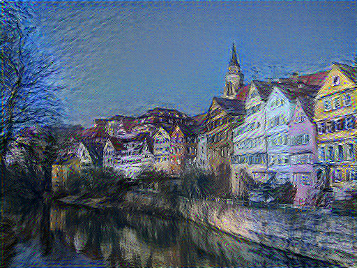
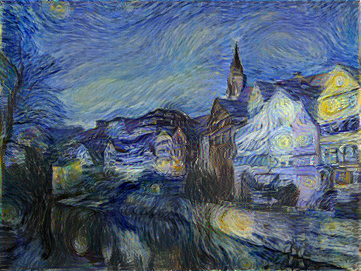
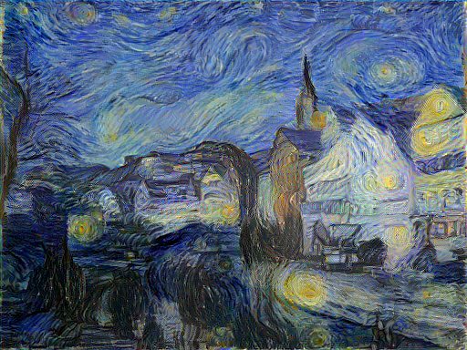
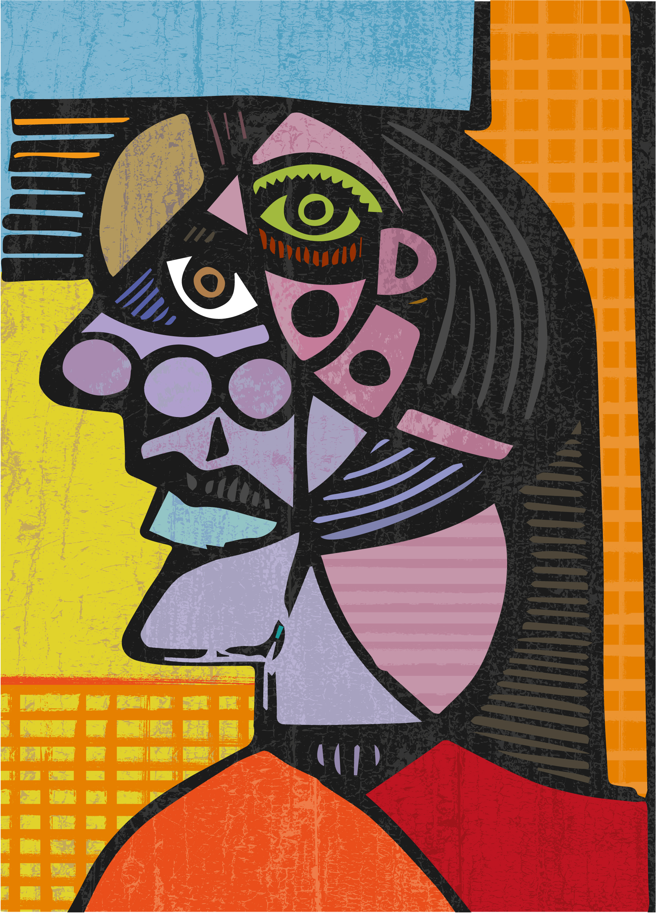
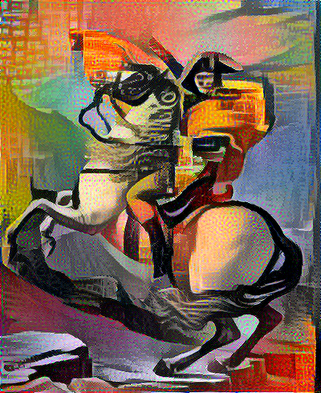
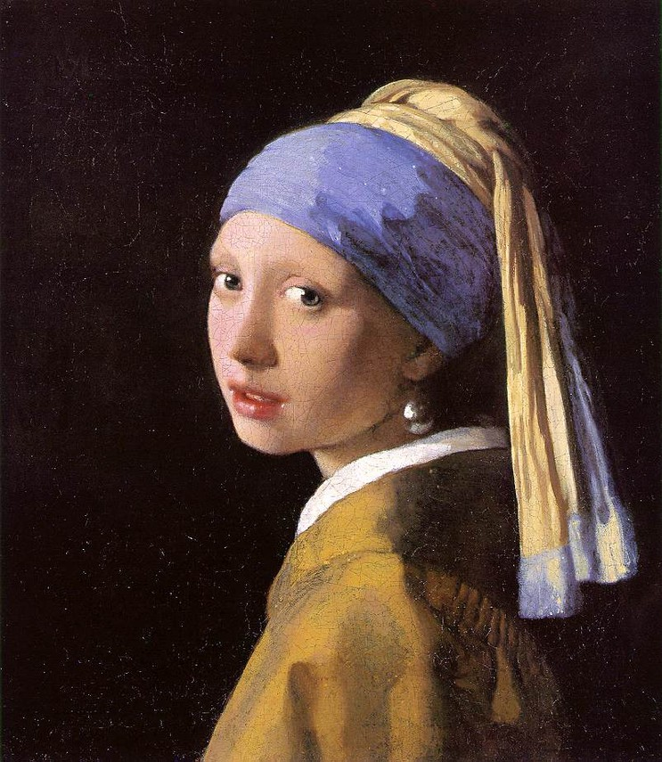
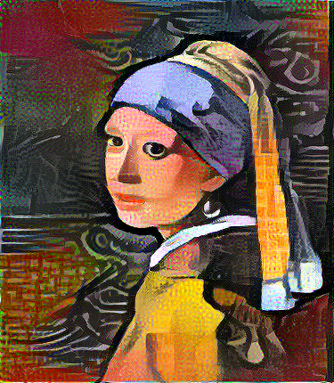
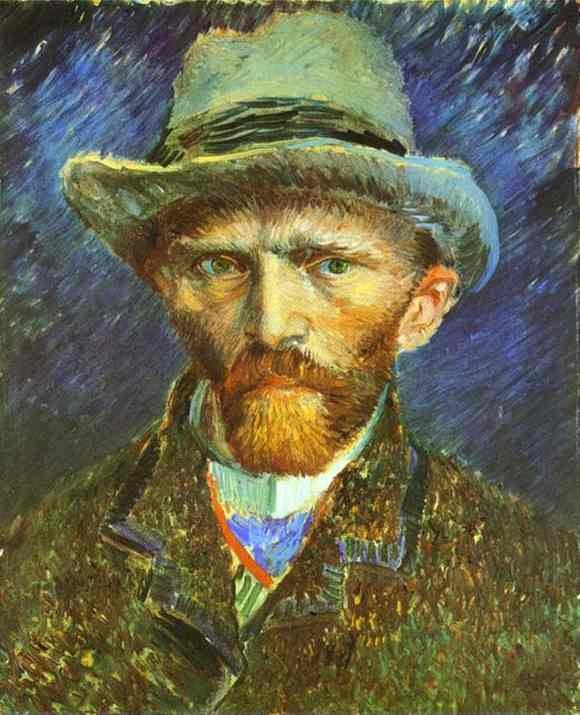
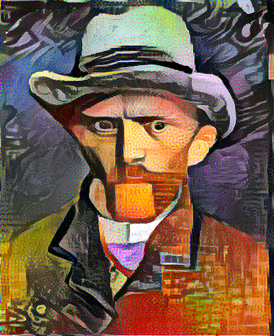

# Image Style Transfer

An implementation of image style transfer described in the paper using tensorflow.
* [Image Style Transfer Using Convolutional Neural Networks](http://www.cv-foundation.org/openaccess/content_cvpr_2016/papers/Gatys_Image_Style_Transfer_CVPR_2016_paper.pdf)

Published in CVPR 2016, written by Leon A. Gatys, Alexander S. Ecker and Matthias Bethge

## Requirement
- Python 3.6.4
- Tensorflow 1.5.0 
- Pillow 5.0.0
- Pretrained VGG19 file : [vgg19.npy](https://mega.nz/#!xZ8glS6J!MAnE91ND_WyfZ_8mvkuSa2YcA7q-1ehfSm-Q1fxOvvs)

## Configuration

- --style_image_path : File path of style image. *Default*: input/starry-night.jpg
- --content_image_path : File path of content image. *Default*: input/tubingen.jpg
- --output_image_path : File path of result image. *Default*: output/result.png
- --alpha : The coefficient of content loss. *Default*: 0.001
- --beta : The coefficient of style loss. *Default*: 10.0
- --vgg_model_path : File path of pre-trained VGG19 model. *Default*: vgg19/vgg19.npy
- --content_loss_layer : Layer(s) included content representation. *Default*: [conv4_2]
- --style_loss_layer : Layer(s) included style representation. *Default*: [relu1_1, relu2_1, relu3_1, relu4_1, relu5_1]
- --height : The height of output image. *Default*: 384
- --width : The width of output image. *Default*: 512
- --epoch : The number of epoch. *Default*: 2000

## How to Run
1) Download pretrained VGG19 file [vgg19.npy](https://mega.nz/#!xZ8glS6J!MAnE91ND_WyfZ_8mvkuSa2YcA7q-1ehfSm-Q1fxOvvs)
2) Move pretrained VGG19 file to directory 'vgg19'
3) python main.py --output_image_path  *"output_img_path"*  --style_image_path *"style_img_path"* --content_image_path *"content_img_path"*

## Results
This is experiment results when using left image as style representation and right image as content representation.

 

The experiment went through changing the beta values. The value of beta increases to the right.( beta = 1, 100, 1500)

This is the experiment result when the above image is used as style representation.
Left image is used as content representation and right image is result image. The value of beta is fixed for all experiments (beta = 10)

## Comments
If you have any questions or comments on my codes, please email to me. [son1113@snu.ac.kr](mailto:son1113@snu.ac.kr)

## References

I refer to some source codes for my implementation

[1]. https://github.com/hwalsuklee/tensorflow-style-transfer

[2]. https://github.com/machrisaa/tensorflow-vgg
* vgg19.py is fixed for my implementation.

